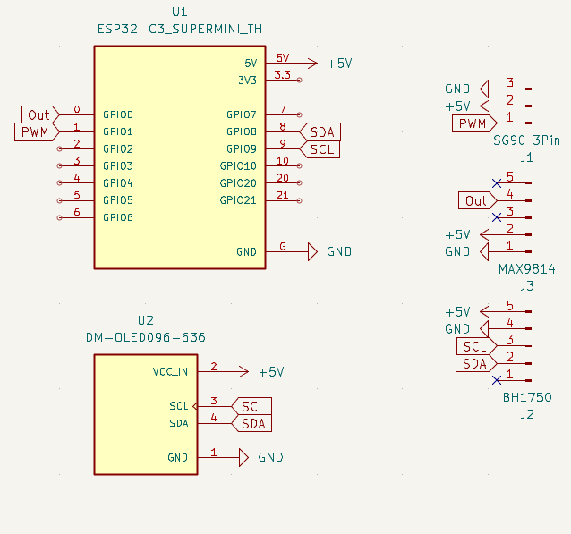
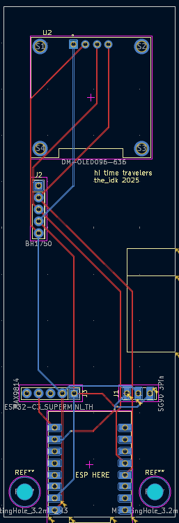
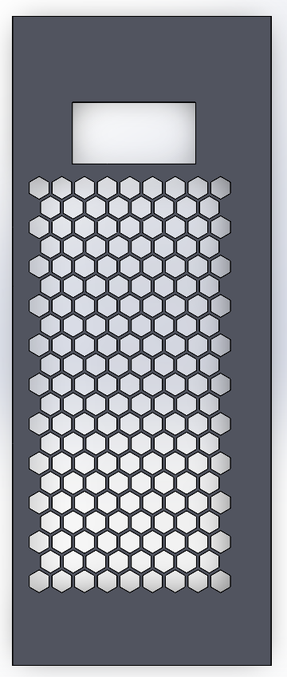
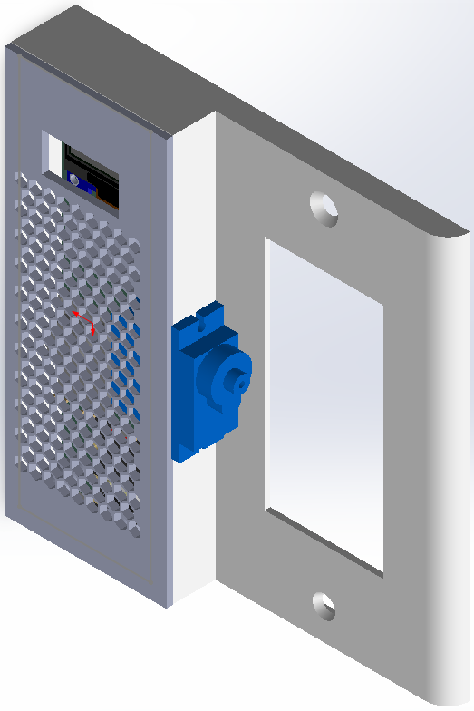

# ESP32 Light Switch
Everyday, I'm late to school because I end up falling back asleep. I find it harder to fall back asleep with the lights on, so I designed a automatic light switch with a servo and ESP32

## Bill of Materials
1 0.96" 128x64 OLED Display  
1 GY-302  
1 MAX9814  
1 ESP32 C3 SUPER MINI PLUS  
1 SG90 Servo  
2 M3*12mm SCHS

## PCB
|Schematic|PCB|
|---|---|
|||

## CAD
|Bottom|Top|
|---|---|
|||
Assembly  

## Final Thoughts
I loved designing this since it was something that would make a impact on my life and solve a problem. 
